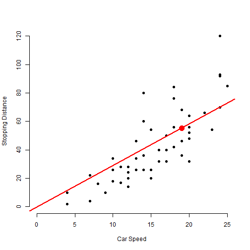
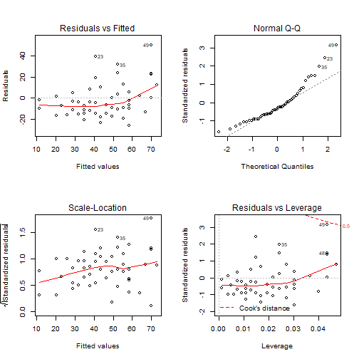

Predicting Stopping Distances of Cars
========================================================
author: "Alán García Bernal"
date: 23/06/2019
autosize: true
transition: rotate

General Information
========================================================

The current Shiny Webb App uses the R dataset 'cars' (for more information on the data set  follow this link: https://stat.ethz.ch/R-manual/R-devel/library/datasets/html/cars.html).


```r
summary(cars)
```

```
     speed           dist       
 Min.   : 4.0   Min.   :  2.00  
 1st Qu.:12.0   1st Qu.: 26.00  
 Median :15.0   Median : 36.00  
 Mean   :15.4   Mean   : 42.98  
 3rd Qu.:19.0   3rd Qu.: 56.00  
 Max.   :25.0   Max.   :120.00  
```

to create and plot 2 linear models with regression to the origin (one linear and one spline), and the respective residual plots.

Also provides the prediction for a selected speed and model, and the formula for the model.

Inputs
========================================================

This App takes 2 different inputs:

- **Slider Input**: between 1 and 25 that determines the miles per hour used to predict the stopping distance.

- **Selection Box**: to determine if the plot will contain a Linear Regression Model or a Spline Model.


Outputs
========================================================

- **Plot A**: a scatter plot with 'speed' in the x-axis and 'stopping distance' in the y-axis. It shows (if the user decides so) the lines for Models A and/or B and the difned point for making the predictions.

- **Predicted Stopping Distance**: the predicted stopping distance for the specified speed according to the selected model (Example below)


```r
data(cars)

fit.lm <- lm(dist ~ speed - 1, data = cars)
predict(fit.lm, newdata = data.frame(speed = 20))
```

```
       1 
58.18264 
```

- **Selected model**: a text box with the selected model. (Example below)


```r
print(fit.lm)
```

```

Call:
lm(formula = dist ~ speed - 1, data = cars)

Coefficients:
speed  
2.909  
```

Plot
========================================================
This is an example of the plots produced by the App:



